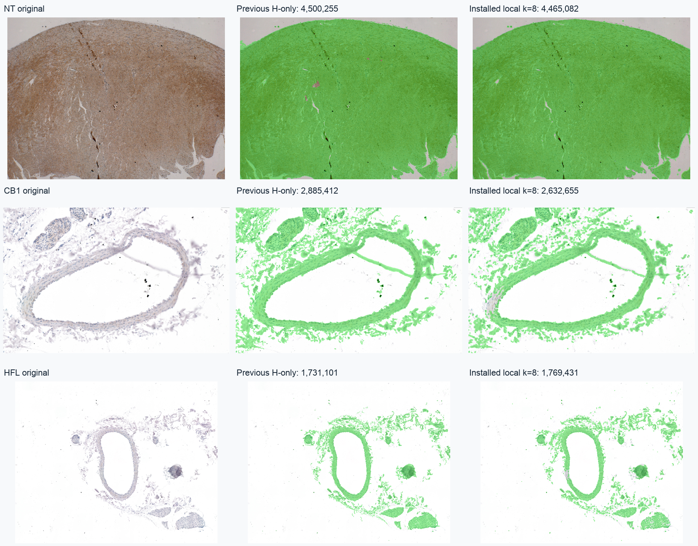

# Local-transition plugin installation validation

Installed default: `local-hdab-1.0`, k=8. The previous H-only method remains selectable with `tissuemodel=h_only`.



## Checks

- 81 Java checks pass against the installed artifact: 36 previous-method checks and 45 local-model checks.
- The installed-JAR save smoke test generated all 12 expected outputs and identified `local-hdab-1.0` in its CSV.
- Python experiment versus installed Java on NT: IoU 0.9999749171032658; 112 differing pixels; identical H seed masks.
- The previous-model option reproduces the earlier NT mask exactly.
- All three images: saved tissue mask count equals CSV; DAB mask is a subset of tissue; H seeds are retained; raw H/DAB/residual array hashes match the previous model.
- Optimizer, strict-gate scoring, percentile normalization and stain matrix methods are source-identical to the previous plugin (`policy_preservation.txt`).
- Documented build class files are byte-identical to installed JAR entries.

## Measurements on identical saved JPEG inputs

| Image | Previous tissue | Local k=8 tissue | Local DAB-positive | Local DAB fraction |
|---|---:|---:|---:|---:|
| NT | 4,500,255 | 4,465,082 | 359,611 | 8.0538% |
| CB1 | 2,885,412 | 2,632,655 | 252,348 | 9.5853% |
| HFL | 1,731,101 | 1,769,431 | 160,846 | 9.0903% |

These are implementation consistency and visual-QA results, not manual-annotation accuracy. The k=8 setting was reviewed on NT; the smaller CB1 selection warrants inspection of pale stroma. Colored debris and sparse-H/DAB-negative tissue remain limitations. Adding DAB to tissue selection makes the area dependent on marker staining. Raw measurement channels and strict DAB-positive policy remain unchanged, but their normalization domain changes.

## Installation provenance

Installed JAR: `/Users/tom/Fiji/plugins/H_DAB_Dominance_Extractor.jar`

SHA-256: `4f29d4ba496631cbe0d2e7df2611f5c85318dfe43622ef59ed9c7fd54441da4b`

Backup: `/Users/tom/Fiji/cloud_extract_eval/local_transition_plugin_validation/backup/H_DAB_Dominance_Extractor.20260916T190942771979Z.jar`

`build_manifest.json` records source and artifact hashes. `qa_manifest.json` records input/output hashes and paired comparisons. Native TIFFs/CSVs are in `NT/`, `CB1/`, and `HFL/`. Compact package documentation copies include the report/panels; native TIFFs remain in this local validation folder.

## Reproduce

```bash
python3 /Users/tom/Fiji/cloud_extract_eval/build_h_dab_tissue.py --install
python3 /Users/tom/Fiji/cloud_extract_eval/validate_h_dab_local.py
```

Restart Fiji to load the replacement JAR. See [the current plugin guide](../H_DAB_Local_Transition_Plugin.md) for settings, algorithm dissection, interpretation and rollback.
