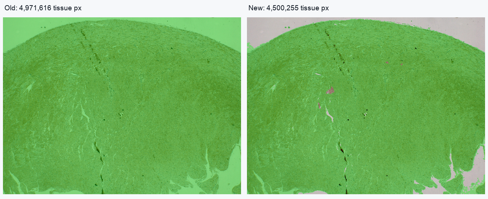
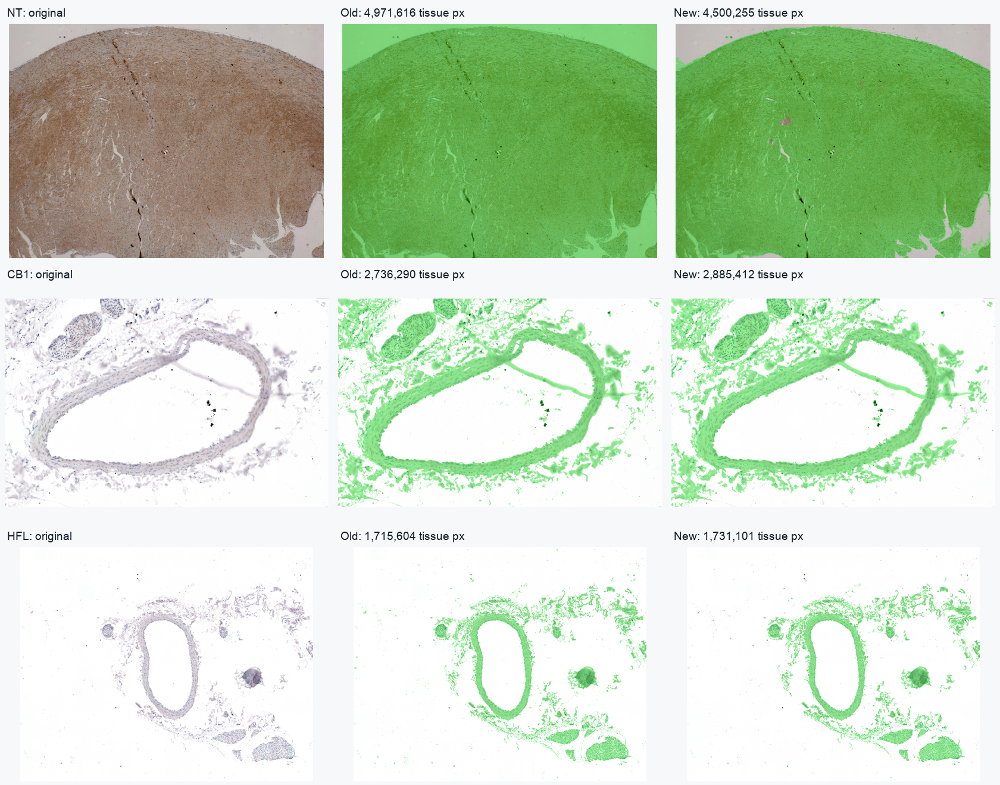
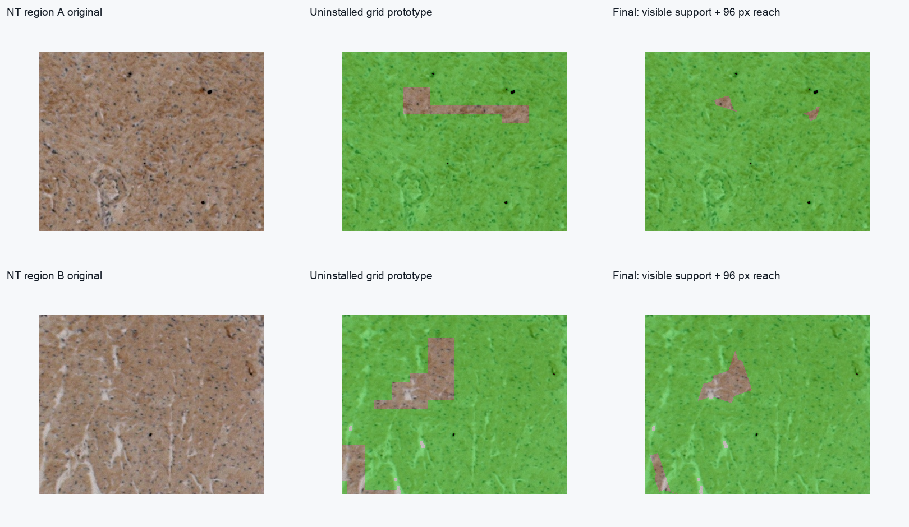
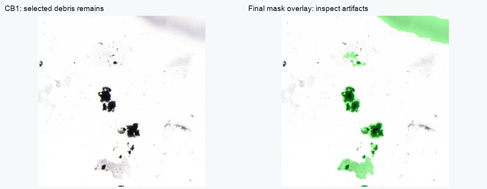

# Tissue-mask Java validation — 16 September 2026

Installed algorithm: `h-spatial-1.2`. All results below were produced by the actual original or updated Java JAR on the same saved JPEG copies. This is reproducibility and mask sanity evidence, not annotated real-tissue accuracy.

## Final paired measurements

| Image | Total pixels | Old tissue | New tissue | Old DAB fraction | New DAB fraction |
|---|---:|---:|---:|---:|---:|
| NT | 4,971,616 | 4,971,616 | 4,500,255 | 7.1815% | 7.9858% |
| CB1 | 8,992,295 | 2,736,290 | 2,885,412 | 9.6433% | 9.2017% |
| HFL | 16,200,000 | 1,715,604 | 1,731,101 | 9.2821% | 9.1340% |

NT excludes 471,361 formerly counted pixels (9.4810% of the frame); its new selected area is 90.5190% of the frame. CB1 and HFL can increase overall because spatially supported small-gap closing adds pale/bright inter-nuclear gaps as other pixels are removed. These additions are an explicit part of the tissue-area definition, not proof of more accurate biological area.

| Image | Removed from old mask | Added to old mask | Old DAB-positive pixels | New DAB-positive pixels |
|---|---:|---:|---:|---:|
| NT | 471,361 | 0 | 357,037 | 359,382 |
| CB1 | 70,017 | 219,139 | 263,868 | 265,506 |
| HFL | 85,430 | 100,927 | 159,244 | 158,118 |

Raw H, DAB, and residual float-array hashes match between original and updated Java output for all three inputs. The unchanged DAB optimizer and strict gate are fed new tissue-only p99 scales; consequently the DAB-positive mask can change even though the detection policy is unchanged. Each saved positive mask was checked to be a subset of the saved tissue mask, and saved tissue pixel counts equal CSV counts.

## Visual inspection

Green means selected tissue. PNG panels are downsampled for review; TIFF masks and overlays in `after/` preserve native resolution.







The NT rectangular omissions had two causes: tile-level support grouping and square distance contours. Sliding 17×17 windows combine evidence across tile boundaries; cardinal/diagonal path costs 3/4 remove axis-aligned square reach contours. A 96-pixel default retains more pale tissue near sparse H than the conservative 64-pixel alternative. Small omissions remain where supported H is too distant or material fails visibility/path constraints. These are unresolved segmentation errors or ambiguities, not intentional biological holes. Larger vessel lumens and outer background remain predominantly unselected.



The debris panel deliberately exposes a failure mode: clustered H-colored material can seed a selected region despite being non-tissue. The dark-pixel cutoff is only a safeguard and cannot remove all intermediate-intensity artifact pixels or their colored edges. No final artifact-cleanup claim is made.

## Java regression checks

`policy_preservation.txt` confirms the optimizer, strict-gate scoring, percentile, normalization, and stain-matrix methods are source-identical to the prior implementation. `smoke_verification.txt` confirms all 12 expected files were saved by the installed JAR.

`installed_test_results.txt` records 36 passing checks against the installed JAR, including neutral/tinted/black backgrounds, fixed-reference neutral darkness and pure DAB, isolated H noise, independent RGB noise, weak-H failure, known-reference all-H tissue, unknown-reference uniform stain, edge/disconnected tissue, empty image center, lumens, pale tissue, nonrectangular ROIs, background-only ROI, zero-denominator NaN export, strict DAB decisions, raw DAB integral, invalid parameters, and macro parsing.

The synthetic geometry has 18,304 tissue pixels and 1,750 supported H seed pixels; tissue-mask IoU against its analytic shape is 1.0. This verifies the controlled fixture, not real tissue accuracy. All 16 integer offsets relative to the sampling grid give exactly identical aligned phantom masks.

## Translation and random-seed sensitivity on NT

Whole-frame cyclic shifts preserve the RGB histogram. Comparison excludes a 124-pixel margin to avoid wrapped-edge effects; 3,915,136 interior pixels remain. Adaptive sampling is re-estimated for each shifted image, so exact equality is not expected.

| Shift (x,y) | PRNG seed | Aligned interior IoU | Disagreement pixels |
|---|---:|---:|---:|
| (1, 1) | 20260916 | 0.999812 | 712 |
| (7, 11) | 20260916 | 0.999414 | 2,223 |
| (15, 15) | 20260916 | 0.998403 | 6,069 |
| (0, 0) | 47 | 0.997969 | 7,719 |

These are stability comparisons to the unshifted result, not comparisons to a manual truth mask. Nonzero differences reflect the adaptive reference/threshold samples and native pixel geometry; the full per-run thresholds/counts are in `NT_stability.csv`.

## Reach sensitivity with the final distance rule

| NT reach | Tissue pixels | DAB-positive pixels |
|---|---:|---:|
| 64 px | 4,366,304 | 347,551 |
| 96 px (default) | 4,500,255 | 359,382 |
| 128 px | 4,508,465 | 360,492 |

The 96-pixel choice is an inspectable compromise: 64 px leaves more sparse-H tissue unselected; 128 px adds another 8,210 pixels (+0.182% of the default selected area). The reference, H threshold, visibility threshold, and DAB policy are otherwise held constant. Full masks and CSVs are in `sensitivity/`. This is not parameter optimization against ground truth.

## Source provenance and historical caveat

Inputs are the three `*_A_original.jpg` files in `../ihc_visual_postprocess_experiment/`, at their saved native dimensions. They are existing JPEG copies; original acquisition data and exact export/compression history are not available. `qa_manifest.json` records SHA-256 hashes of inputs, original/installed JARs, and generated TIFF/CSV outputs.

The current old-JAR runs count CB1 = 2,736,290 and HFL = 1,715,604 tissue pixels. Historical CSVs counted 2,733,252 and 1,716,725 on earlier input files. These small differences must not be attributed to this correction: the paired counts above use the same saved copies before and after. NT remains 4,971,616 with the old JAR.

The old tissue mask was not an exported object. The QA runner reconstructs its exact `sqrt(sum(OD²)) >= 0.08` predicate and asserts its count equals the actual old Java measurement before saving the baseline mask. All baseline DAB decisions and measurements come directly from the old JAR. Historical Python F1/QC benchmarks have a different tissue selection implementation and are not used here.

## Installation and reproduction

Installed JAR SHA-256: `23a6ad262e451d4b403b04b2f4f22bb452f15bb5a18d4ce9f24d93fae875e3e1`.

Backup before replacement: `/Users/tom/Fiji/cloud_extract_eval/tissue_mask_validation/backup/H_DAB_Dominance_Extractor.20260916T181154477197Z.jar`.

```bash
cd /Users/tom/Fiji
python3 cloud_extract_eval/build_h_dab_tissue.py --install
python3 cloud_extract_eval/validate_h_dab_tissue.py
```

The build script compiles Java 8-compatible bytecode with the bundled JDK and ImageJ 1.54p, packages only H-DAB classes plus a single H-DAB menu entry, runs tests, backs up the previous installed JAR, atomically replaces it, and re-runs tests against the installed file. Restart an already running Fiji instance to load the new class definitions. This report does not claim the running GUI has hot-reloaded the JAR.

Runtime on this machine for the final paired QA pass, including requested TIFF/CSV QC output, was about 2.0 s (NT), 2.3 s (CB1), and 3.4 s (HFL) for the updated JAR with a 6 GB heap ceiling. These are one-pass observations, not a benchmark guarantee.

## Immediate review plan

1. Restart Fiji and inspect the new tissue mask plus H evidence image on a representative ROI before using its DAB fraction.
2. Review pale stroma, lumens, fragmented tissue, colored debris, and sparse-H omissions at native resolution.
3. Use a measured background reference and consistent physical scale when comparing acquisition settings.
4. Obtain manual tissue annotations across representative images before claiming tissue-area accuracy. If H is absent, use an explicitly separate manual or supervised tissue method rather than lowering thresholds until a mask appears.
5. Treat the strict DAB-positive policy as a separate future review; it remains unchanged here.

See [the mathematical dissection](../H_DAB_Tissue_Mask_Correction.md) for equations, every default, limitations, and alternatives.
